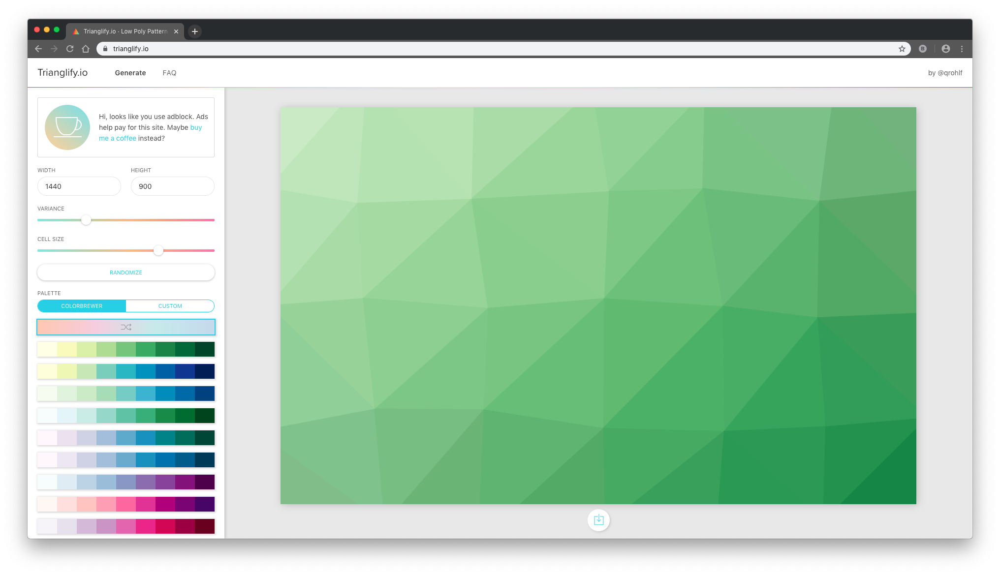
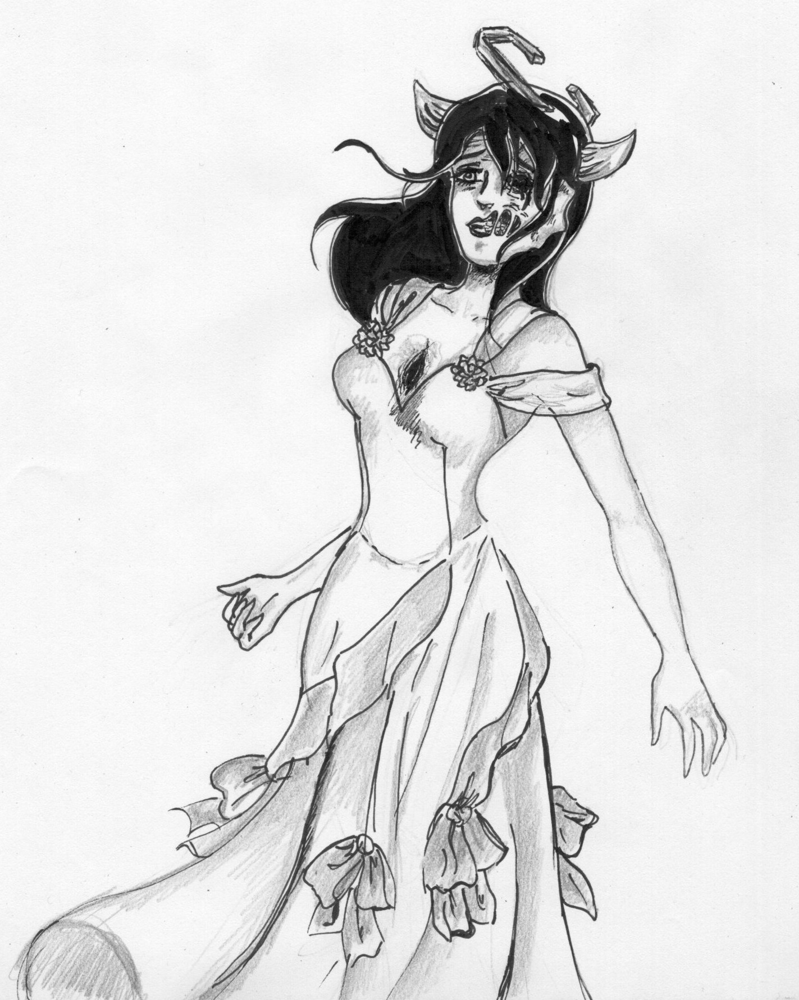

# Backgrounds
AliceOS comes with a unique set of backgrounds that include different art types. OEM manufacturers may want to replicate this style in their own AliceOS distributions to maintain consistency.

## Background bases
AliceOS backgrounds usually have abstract, low-poly art as the base. This type of art stems from some backgrounds and designs Canonical uses for Ubuntu and Vanilla design as a whole.

In most cases, the AliceOS team uses the [Trianglify](https://trianglify.io) web tool to achieve this effect. The tool is free and allows for the result product to be freely used anywhere.

There are a few things we do to make ours unique:

- We use a 16:9 aspect ratio so that it scales well with Ren'Py backgrounds and widescreen displays. Most backgrounds are 1280x720, but a higher resolution can be set.
- We use the colors found in the Elementary stylesheet as per our own style code (see [Colors](styles.md#colors)).

## Sketches
Our foreground part of AliceOS backgrounds contain sketches by the CG and special case artist for our sister project, DDTAR, Noelia. These sketches are layered on top of the poly art and blended with either "Color Dodge", "Multiply", or "Linear Burn". To achieve this effect with any piece of art, including colored images, we recommend the following:

- Convert the color image to grayscale/black and white. This makes blending a lot easier and less "ugly".
- Play with the blending modes available in your photo editor to achieve the desired effect. Some pieces of art require different blending modes.
- Remove unnecessary content, such as backgrounds. This helps keep the focus to the art itself, not its surrounding content.

## Special cases
At other times, AliceOS uses photos or poly-art overlays to achieve such effects:

- We will use grayscale poly art as an addition, blended layer if needed.
- Photos are adjusted to have less emphasis so that the poly art can blend well with it.
- A base color is set in the back and the sketch is applied before the poly-art overlay.