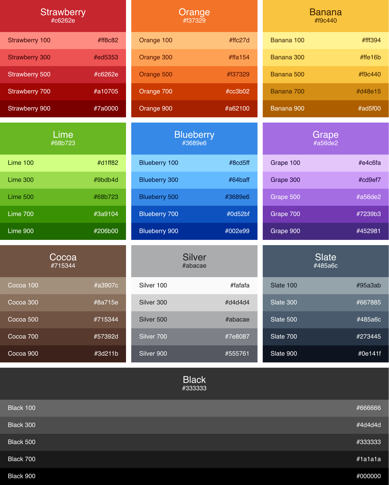

# AliceOS Stylesheet
To create a unique stylesheet that matches the vibrancy and openness of AliceOS, we've created a special style system, **Acolyte**, to accomplish this.

## Design languages
AliceOS follows a combination of the [Material design language]
(https://material.io) and Canonical's [Vanilla design language](https://vanillaframework.io). While Vanilla provides the basic structure, Material adds additional design features such as shadows to provide a cohesive interface.

For those wanting to make websites using this combined system, we recommend linking to our CSS stylesheet:

<pre><code class = "prettyprint lang-html">
&lt;link rel="stylesheet" href="https://aliceos.app/assets/css/main.css"&gt;
</code></pre>

## Default font

AliceOS's default font family is _Nunito_, which is freely provided by Google Fonts as well as within AliceOS. Nunito provides readable text that looks and feels modern as well as matching closely to AliceOS's brand font, Comfortaa.

## Colors
We've adopted the [ElementaryOS color palette](https://elementary.io/docs/human-interface-guidelines#color) as our default color palette for its vibrancy and clarity in context.

