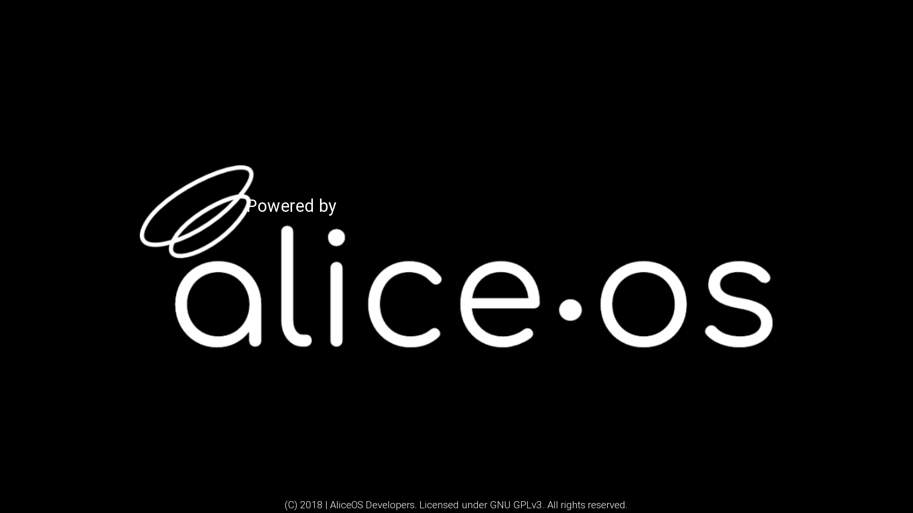

# Boot Screens
The boot screen is an important part of any AliceOS project; the boot screen checks the integrity of some parts of the system and informs the user that he/she is using AliceOS.

## Types of boot screens
There are two distinct boot screens that AliceOS contains for use. Both of these boot screens perform the same functions.

### Standard boot screen

The standard boot screen is generally used in projects that want to emphasize AliceOS as an integral part of the game. This also indicates that the AliceOS system has not been modified for use or is a first-party mod created by the AliceOS team.

### OEM boot screen

The OEM boot screen is generally used in projects that don't put a heavy emphasis on AliceOS as an integral part of the game. This also indicates that the AliceOS system has been modified heavily for the Ren'Py project specifically or is a third-party mod.