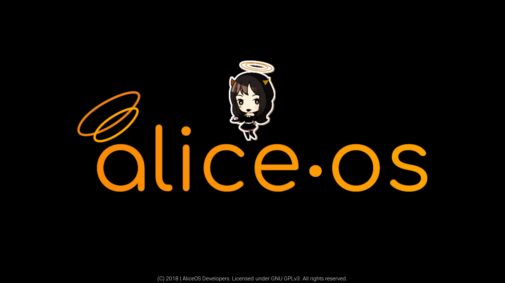

# Boot Screens
The boot screen is an important part of any AliceOS project; the boot screen checks the integrity of some parts of the system and informs the user that he/she is using AliceOS. There are two distinct boot screens that AliceOS contains for use. Both of these boot screens perform the same functions.

## Standard boot screen

The standard boot screen is generally used in projects that want to emphasize AliceOS as an integral part of the game. This also indicates that the AliceOS system has not been modified for use or is a first-party mod created by the AliceOS team.

#### Use the standard boot screen if:
<ul class="p-list">
    <li class="p-list__item is-ticked">The core components of AliceOS have been unchanged</li>
    <li class="p-list__item is-ticked">The game/mod is created by the AliceOS team or approved partners</li>
    <li class="p-list__item is-ticked">The AliceOS installation is cusomized through additions</li>
</ul>

## OEM boot screen

The OEM boot screen is generally used in projects that don't put a heavy emphasis on AliceOS as an integral part of the game. This also indicates that the AliceOS system has been modified heavily for the Ren'Py project specifically or is a third-party mod.

#### Use the OEM boot screen if:
<ul class="p-list">
	<li class="p-list__item is-ticked">The core components of AliceOS have been changed</li>
	<li class="p-list__item is-ticked">The game/mod is made by a third party</li>
	<li class="p-list__item is-ticked">The AliceOS installation is completely customized, including branding assets</li>
</ul>

## Implementation
To incorporate this into your project, add the following lines to the beginning your `splashscreen` label:
<pre><code class = "prettyprint lang-py">
call bootloader
</code></pre>

The project, depending on your settings in `OEMSettings.rpy`, will determine which boot screen to display.
