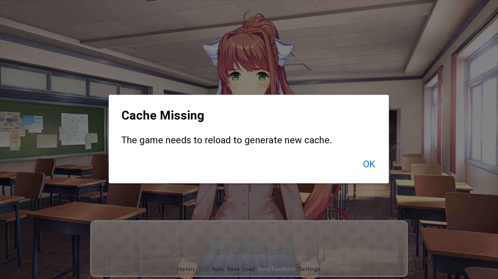
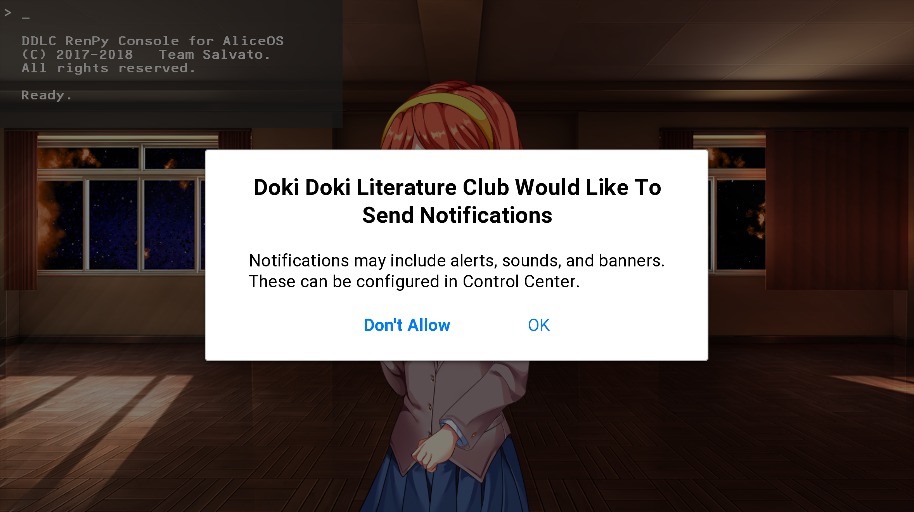
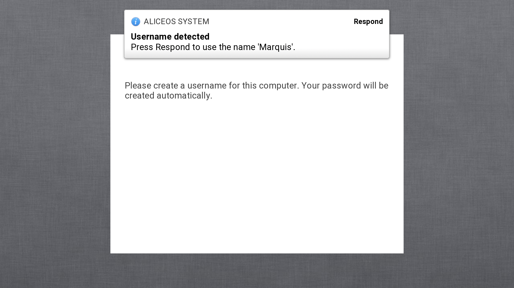

Notifications
=============

Notifications provide a level of interactivity and information updates for your Ren'Py project. The notification system built into AliceOS contains screens for both the native and custom functions regarding dialog and notification management. This document will cover the screens themselves rather than the Applet functions to make use of them.

  

    Tip:If you commonly use a particular notification, you may want to wrap your call statement in a label.
  

## Alerts

*Alerts* provide a message that requires an action, usually by pushing a button. They can be terse or have details with a title and message.

`alert(title, message, ok_action)`

Presents an alert to the user that requires an action.

-   `title` - the main message
-   `message` - the details or relevant information
-   `ok_action` - the function called when user presses OK

<pre><code class = "prettyprint lang-py">
call screen alert("File Not Found", "The file specified could not be found.", ok_action=Return(1))
</code></pre>

  

    Note:If you need the user to make a decision, using the confirmation alert may be more beneficial.
  

## Confirmation Alerts

`confirm_alert(title, message, no_action_message, no_action, yes_action_message, yes_action)`

Presents an alert that requires the user to make a choice.

-   `title` - the main choice text
-   `subtitle` - the details or relevant information to the choice
-   `no_action_message` - the negative button's text (placed on left)
-   `no_action` - the function called when user presses negative button
-   `yes_action_message` - the positive button's text (placed on right)
-   `yes_action` - the function called when user presses positive button

  

    Important:If you need to ask the user permission for common applet tasks, use <code>ask_permission</code> instead.
  

<pre><code class = "prettyprint lang-py">
call screen confirm_alert("Do You Want To Run Alice32?", "Running this software may harm the AliceOS system.", "Don't Run", no_action=Return(1), "Run Anyway", yes_action=Return(0))
</code></pre>

## Permissive Alerts

*Permissive alerts* are alerts that require the player to grant access to parts of the AliceOS system. These usually include sending notifications, modifying the file system, and changing system settings. Applets have a native function for asking all of its permissions accordingly: `ask_all_permissions()`.

`ask_permission(applet.long_name, action, no_action, yes_action)`

Asks the user permission to perform an action or to access a
system-related function.

-   `applet.long_name` - the name of your app
-   `action` - the action that requires permission:
-   `allow_un` - send notifications to the user
-   `allow_fs` - access the AliceOS file system beyond the Home
    directory
-   `allow_sip` - modify system settings or gain system control
-   `no_action` - function called when user presses Don't Allow
-   `yes_action` - function called when user presses OK

<pre><code class = "prettyprint lang-py">
call screen ask_permission(ddlc.long_name, allow_fs, no_action=Return(1), yes_action=Return(0))
</code></pre>

## Banners

*Banners* provide a temporary pop-up at the top of the screen that has the option for a response before hiding itself after five seconds. Applets have a native function for doing this without needing to use the screen directly: `send_temporary_notification()`.

    

        Note:If you need to send a notification on the behalf of the <i>operating system</i>, use <code>SystemUIServer.send_temporary_notification()</code>.
    

`banner(applet, title, message, response)`

Presents a temporary banner at the top of the screen. Automatically dismisses after five seconds and returns a value of `0`.

-   `applet` - the applet sending the notification
-   `title` - either the sender or the main message
-   `message` - the message or details
-   `response` - function called when the user presses Respond

  

    Note:If you need something "quick n' dirty", you can also make use of <code>renpy.notify()</code>; however,you won't have the same control as <code>banner()</code>.
  

<pre><code class = "prettyprint lang-py">
call screen banner(ddlc, "New character added!", "Monika's now in the game.", response=Return(1))
</code></pre>

## Customizing notifications
Backgrounds for the notification frames are located in the `Resources` directory. Any additional font customizations are taken from `OEMSettings.rpy`.