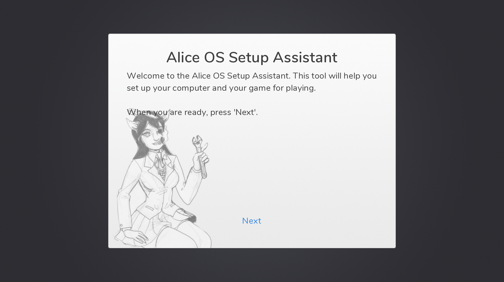
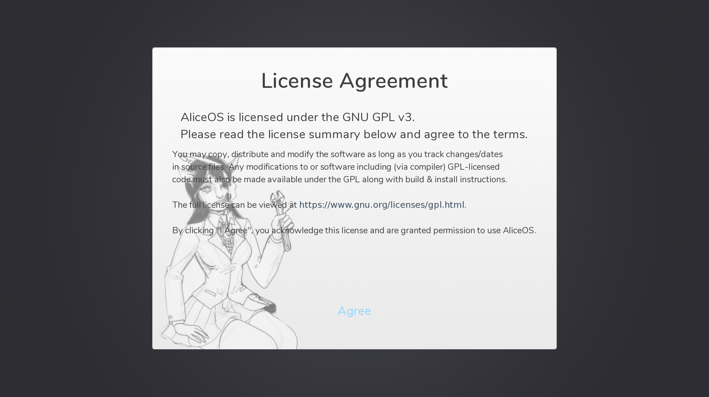
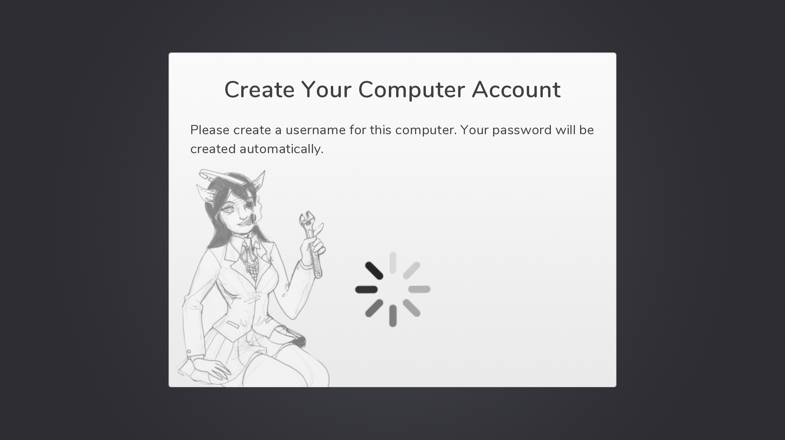
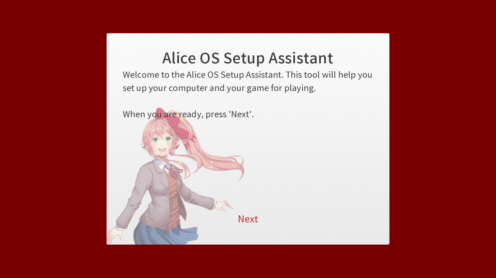
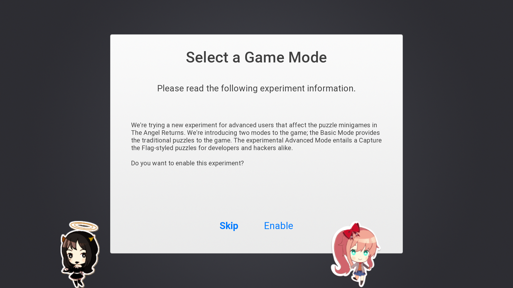

# Post installation setup assistant (Pisa)
AliceOS comes bundled with a setup assistant to allow users to configure AliceOS and the game before starting it for the first time. By default, the setup assistant completes the following tasks:

- Introduce players to the beta mode, if applicable.
- Display licenses that need to be agreed to before starting.
- Creating a username for use in-game.

## License agreements

The license agreement screens are usually the first screen presented to the user after starting the setup assistant. In all AliceOS distributions, the first license (if not only) will display a summary of the GNU GPL v3 license. The user must agree to the terms to continue. Otherwise, the setup assistant will halt and a Stop error is thrown.

Additionally, if your game includes its own license agreement or disclaimer, it can be called and acted in the same way.

## Account creation

The other major component includes the user account creation screen. This screen allows users to enter in a name that is presented in-game via the variable `persistent.playername`. It also creates a `profiles.moj` file with `sierra` as the "password".

## Customizing the setup assistant

The setup assistant can be customized with special branding, colors, or fonts. Typically, these screens rely on assets found in the `Resources` folder, but they can optionally point to new files. The source file to edit this assistant can be located in `CoreServices/ASetup.rpy`.

In addition to modifying the look of the Setup screen, developers can add additional steps to the Setup process as per the code found in `ASetup.rpy`.