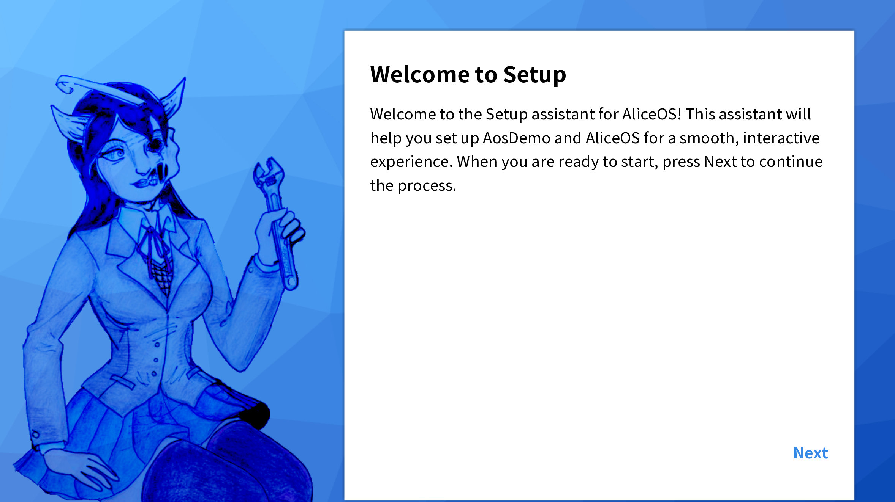
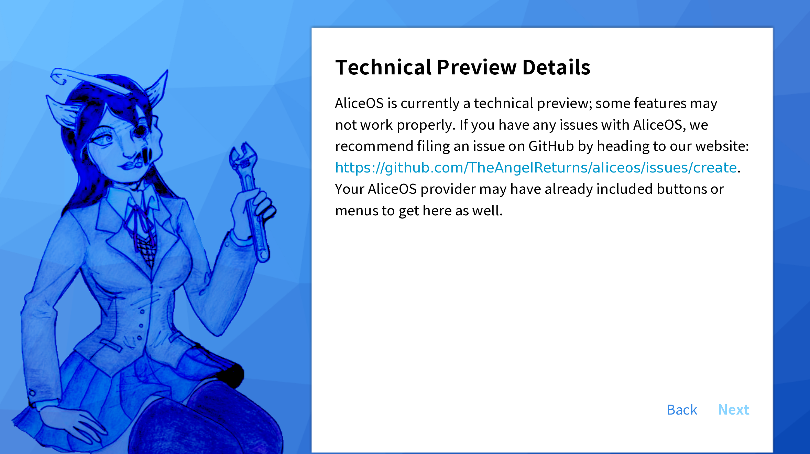
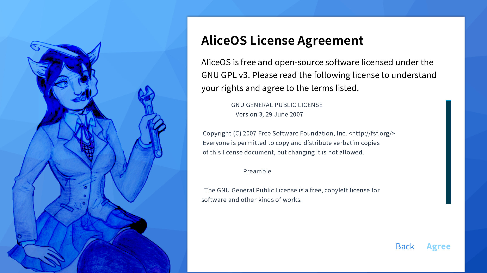
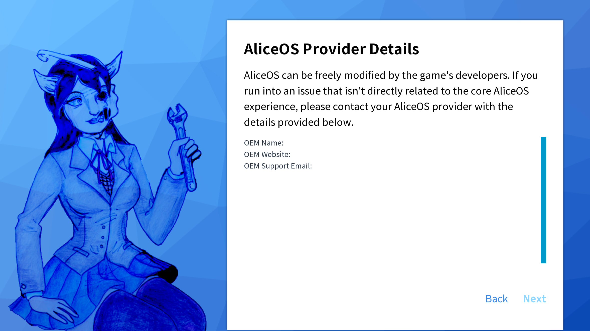
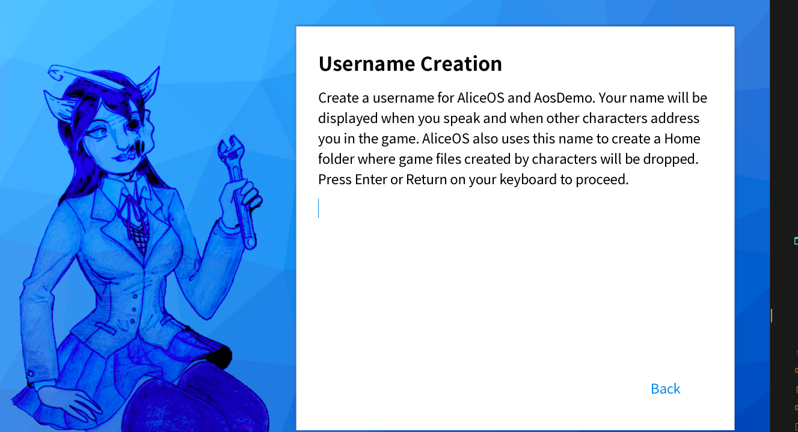
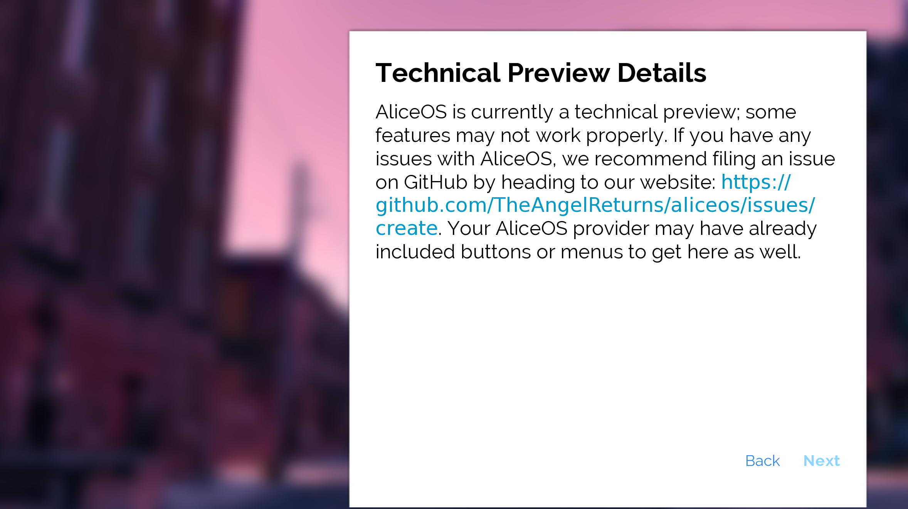

# Post installation setup assistant (Pisa)

AliceOS comes with a setup assistant, Pisa, used to accomplish common tasks in setting up a game. Pisa is a modular assistant, meaning that developers can edit the assistant in any way needed. Pisa respects fonts and background choices as outlined in the OEM settings. Generally, most Pisa configurations follow this flow:

- Greet the user and present information about Pisa's purpose.
- Display any imporant information about AliceOS (technical preview, changelog, etc.).
- Display AliceOS license and game licenses and have users agree to terms.
- Display AliceOS OEM information.
- Collect username.

## General Setup process
### Details page

The details page displays information about the current release of AliceOS used in the Ren'Py project. For technical previews, information about its preview state is displayed, as well as a link to the issue page.

### License pages

The license pages display the according licenses for the project. AliceOS's GNU GPL v3 license in its entirety is displayed, and any custom agreements will be displayed on another page. OEMs can add such licenses in OEM settings or present more licenses with extra license screens.

  

    Important: In this version of Pisa, the license pages do not prompt the user to confirm their agreement to the licenses. We recommend simplifying your license to ensure users will read and agree to the terms. Additionally, OEMs have the right to add a confirmation prompt after these screens.
  

### Provider details

The provider details page displays any important information about the OEM if AliceOS has been modified. OEMs can change information in OEM settings as well as add additional information.

### Username collection

The username input page prompts users to type in a name. Setup will automatically determine what input its receiving and save the data into `persistent.playername` accordingly. If the input is null, a Stop error (`SETUP_ASSISTANT_FAIL`) is thrown. Additionally, users are required to press the Return or Enter key instead of pressing a button.

## Customising the Setup assistant

### OEM settings
Pisa will adhere to the following OEM settings:
- OEM mode
- OEM fonts (text will be rendered and justified accordingly)
- OEM information (displayed in provider details)
- Large font mode (aka. `oem_pisa_large_font`)

### Custom assets
The resources for Pisa are located in `Resources/pisa`. No additional code is needed to change these as Pisa will automatically render them.

### Custom steps
Pisa screens are defined as _elements_ in a `setup` label:
<pre><code class = "prettyprint lang-py">
call screen pisa_element(step, step_details, extra_info, has_back, require_input, advance_type, ok_action)
</code></pre>

#### `pisa_element(step, step_details, extra_info, has_back, require_input, advance_type, ok_action)`
- `step` - the title for the screen. Example: "Username Creation"
- `step_details` - the description of the step. Usually includes instructions on that step.
- `extra_info` - scrollable text or additional information not present in description. Usually used for license displays, OEM information, or large amounts of text.
- `has_back` - whether the user can go back a step. Should only be used on the first step.
- `require_input` - whether the user needs to input text. If `True`, a textbox is added to the screen.
- `advance_type` - the type of progress button displayed:
	- `0` - "Next"
	- `1` - "Agree"
	- `2` - "Finish"
	- `3` - hidden. Generally used in conjunction with `require_input`
- `ok_action` - the action performed when pressing the progress button. Usually is `Return(0)` or `Return(input)`, if `require_input` is `True`.

These steps are located in the label `setup` where everything is processed.