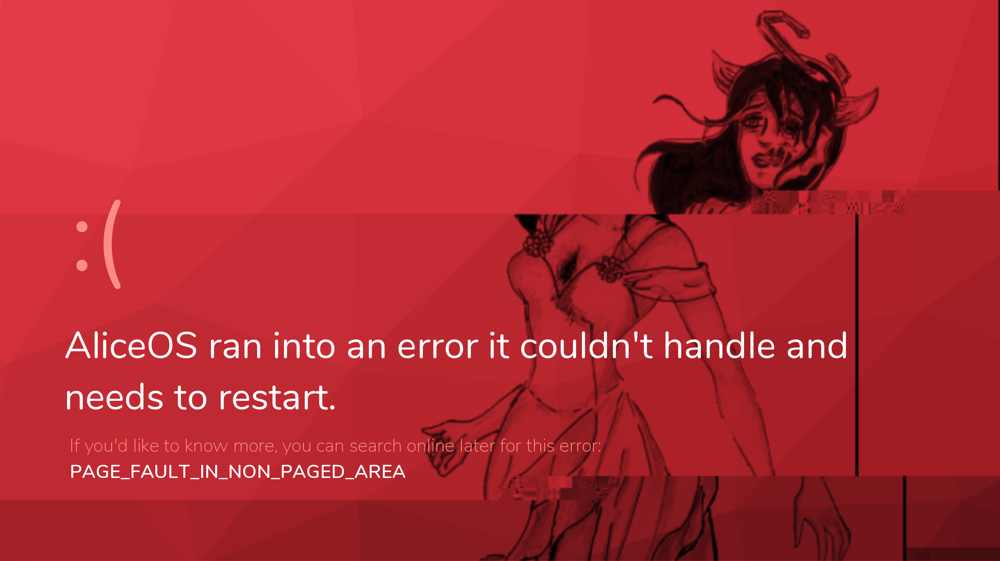
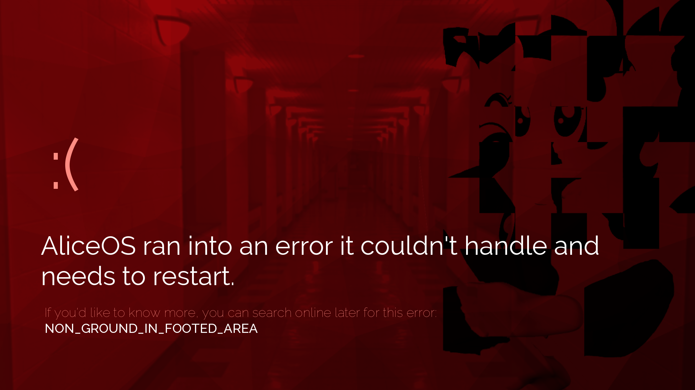

# Stop errors
Stop errors (red screens of death) are system-wide errors that occur when a problem with the operating system has been reached. These errors are similar to ones found in Windows 8 and can be customised to the developer's needs.

## Error database
The AliceOS error database contains causes, solution, and details regarding Stop errors seen in any AliceOS distribution. We recommend users to search there for more information and for developers to submit custom Stop errors to the database.

<a href = "https://errordb.aliceos.app" class = "p-button--brand p-link--external">View Error Database</a>

## Customizing Stop errors

To call a Stop error at any point in your visual novel project, run `call screen ThrowASError()`.

### `ThrowASError(error_type)`
Throws a Stop error and restarts the game.

- error_type - the Stop error code to be displayed. AliceOS comes with three defaults, but additional ones can be added in OEM settings or directly called in the function.

#### Live example
<pre><code class = "prettyprint lang-py">
call screen ThrowASError("PAGE_FAULT_IN_NON_PAGED_AREA")
</code></pre>

### Customizing looks
Fonts are automatically pulled from OEM settings and will be applied when OEM mode and custom font mode is enabled.

The background is provided in `Resources/rsod_overlay.png`. We recommend setting your base background as Strawberry 500 (`#c6262e`).