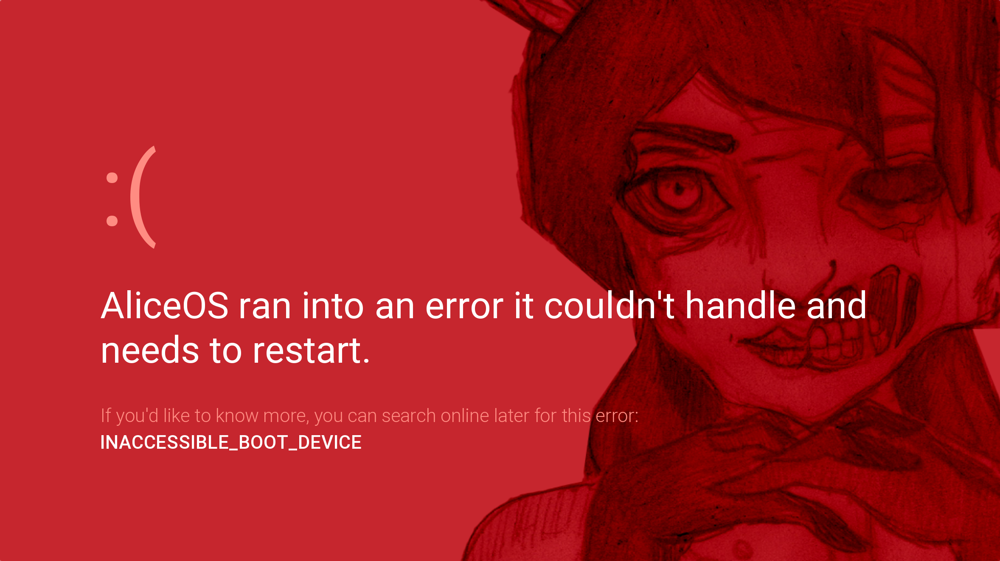
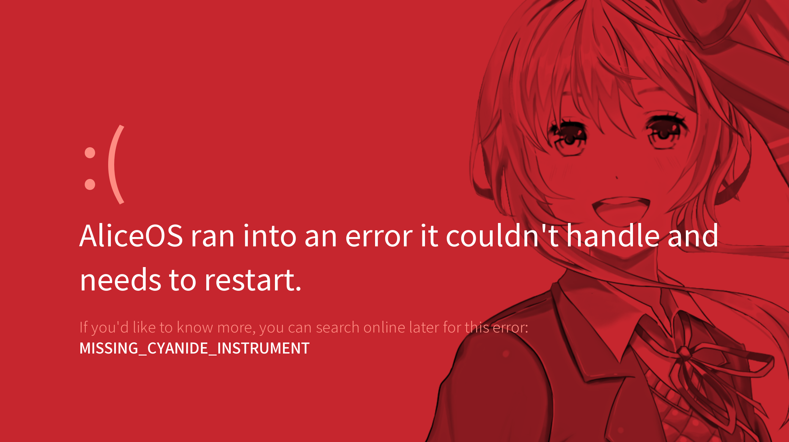

# Stop errors
Stop errors (red screens of death) are system-wide errors that occur when a problem with the operating system has been reached. These errors are similar to ones found in Windows 8 and can be customised to the developer's needs.

## Typical stop errors
- `INACCESSIBLE_BOOT_DEVICE` - the file required to start the integrity check process is missing.
- `ERR_SEALICE_LOCK` - one or more of the SEAlice components are missing. This is displayed if SEAlice has been implemented into your AliceOS distribution.
- `MISSING_CYANIDE_INSTRUMENT` - _Dark nights are upon us! / Black magic slays on the chorus!

Additionally, manufacturers and AliceOS distribution managers can add additional Stop errors. If you receive a Stop error that doesn't match the defaults listed above, plase consult your AliceOS distribution manager or manufacturer.

## Typical causes of Stop errors
These may or may not apply to each Stop error, but these are common causes for such errors.

- SEAlice may have been not properly implemented into the AliceOS distribution.
- The user failed to agree to the license terms of AliceOS or the game that AliceOS is bundled with.
- The script may have called an area that doesn't yet exist or broke in a way that Ren'Py doesn't detect.
- A component needed for a system action was not initialized or made accessible.

## Customizing Stop errors

The source code for Stop error displays are found in `CoreServices\ASErrorHandler.rpy`. Additionally, if you want to customize the background, look for `Resources/rsod_overlay.png`.